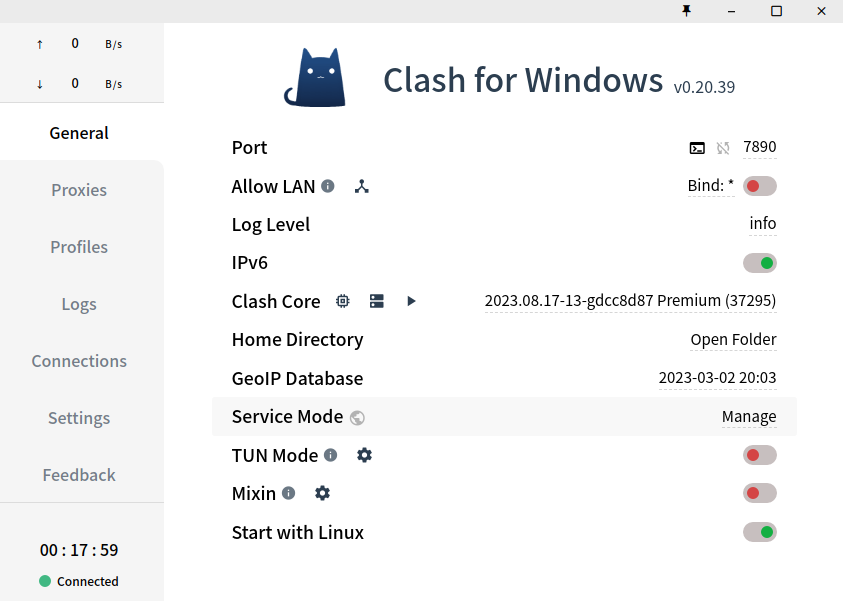
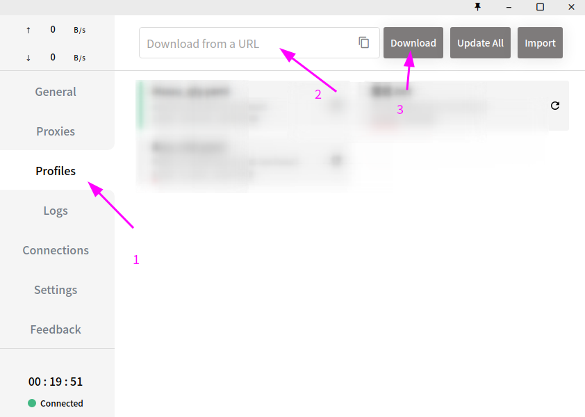
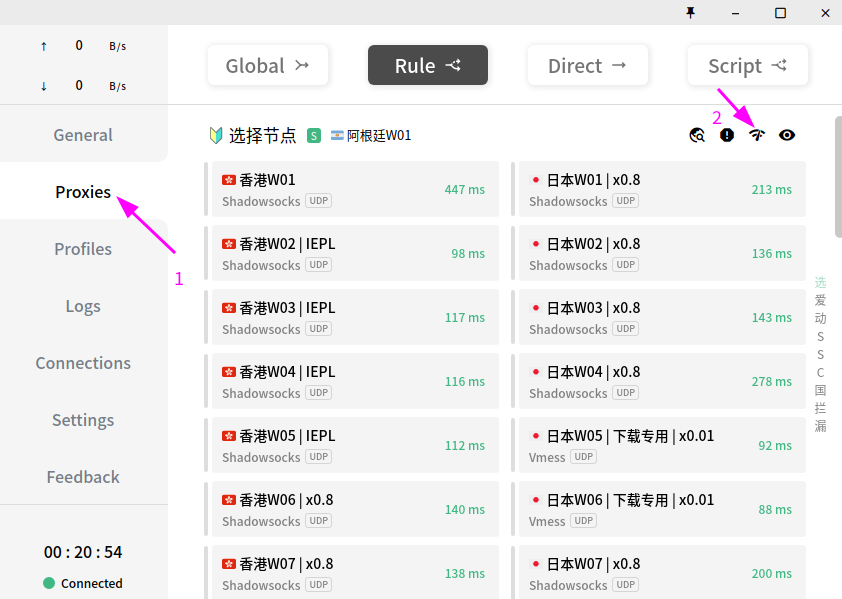
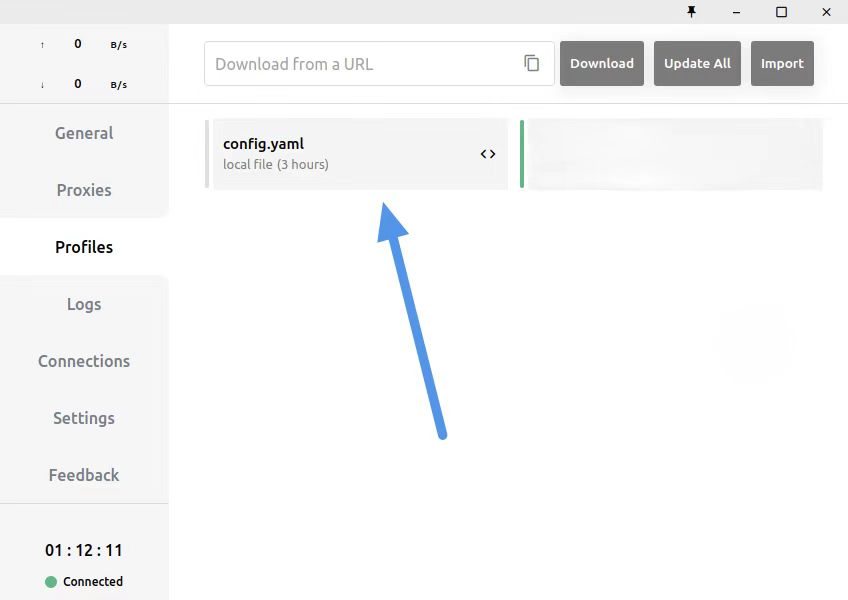

# Ubuntu22.04配置Clash教程

## clash for windows备份仓库[https://github.com/CHH3213/clash-for-windows-backup/releases/tag/v0.20.39](https://github.com/CHH3213/clash-for-windows-backup/releases/tag/v0.20.39)
## 安装步骤
1 首先下载[Clash.for.Windows-0.20.39-x64-linux.tar.gz](https://github.com/CHH3213/clash-for-windows-backup/releases/tag/v0.20.39),下载完成后终端进入下载目录双击压缩包提取到当前目录下，或者运行以下命令解压：

**tar zxvf Clash.for.Windows-0.20.39-x64-linux.tar.gz**

2 解压完成后，进入/opt/目录并创建clash-GUI文件夹:

**cd /opt**
**mkdir clash-GUI**

3 终端回到下载目录运行以下命令将文件夹移动到/opt/clash-GUI:

**mv Clash\ for\ Windows-0.20.39-x64-linux /opt/clash-GUI**

4 进入Clash\ for\ Windows-0.20.39-x64-linux目录，fw就是 clash for windows的意思，原作者把gui界面也移植到了linux中，我们可以运行以下命令打开:

**cd Clash\ for\ Windows-0.20.39-x64-linux**
**./cfw**

打开以后就能看到：

将 Mixin 和 Start with Linux 打开，设置系统代理和开机自启:

将机场购买的订阅链接输入到代理地址导入:

订阅完成后，切换到Profiles页面可以切换节点:

## 配置Ubuntu系统和Firefox网络代理

打开设置，点击网络代理设置：

选择自动代理：

打开Firefox设置:

 

翻到最下面打开网络设置，选择手动配置代理，按图所示添加端口:

## 对于开启clash系统系统代理仍不能进行科学上网的，打开Profiles页面，右键config.yaml编辑，删除里面内容：

## ubuntu16.04,libva error: va_getDriverName() failed ,driver_name=(null)错误处理（没遇到这个问题跳过即可）

### Ubuntu编译安装libva

1 更新软件源:

**sudo apt update**

2 安装支持包:

**sudo apt-get install i965-va-driver libva-intel-vaapi-driver vainfo**

2 运行命令查看开启的接口信息:

**lspci |grep VGA**
00:02.0 VGA compatible controller: Intel Corporation Device 3e92
01:00.0 VGA compatible controller: NVIDIA Corporation Device 1b83 (rev a1)

运行后如果没有看到Intel Corporation Device,则需要在BIOS里开启核显：看到有IGFX等类似设置，具体百度:

3 vainfo支持调用nvidia显卡，但需要先安装驱动:

**sudo apt install vdpau-va-driver**

4 vainfo查看调用情况:

**vainfo**

5 libva环境变量:

**set | grep LIBVA**

应输出:
LIBVA_DRIVER_NAME=i965 #iHD #i965 #nvidia
LIBVA_DRIVERS_PATH=/usr/lib/x86_64-linux-gnu/dri
如果没有请根据库路径将这些添加到系统环境变量:

**gedit ~/.bashrc**

在~/.bashrc文件中添加下面两行:

**export LIBVA_DRIVER_NAME=i965 #iHD #i965 #nvidia**
**export LIBVA_DRIVERS_PATH=/usr/lib/x86_64-linux-gnu/dri**

保存退出并重启终端

6 重新回到/opt/clash-GUI/Clash\ for\ Windows-0.20.39-x64-linux目录下运行gui：

**./cfw**

#### END终端运行命令遇到权限不够的错误，只需在命令前加 sudo 即可
#### 遇到error要学会读报错内容

##### 此教程仅供内部学习交流使用，任何非法用途均与本项目作者无关
